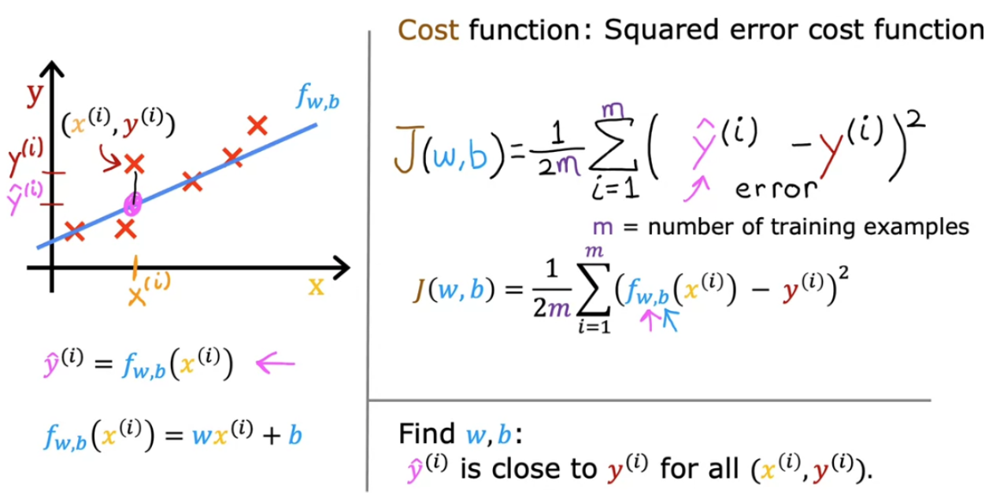

# Machine Learning Course

## Development

```sh
uv init
uv venv .venv
source .venv/bin/activate
```

## Dependencies

```sh
uv add np
uv add matplotlib
```

## Examples

### 1. [001_house_price](./001_house_price.py)

- Training set: Data used to train model


- https://matplotlib.org/stable/tutorials/pyplot.html#sphx-glr-tutorials-pyplot-py




